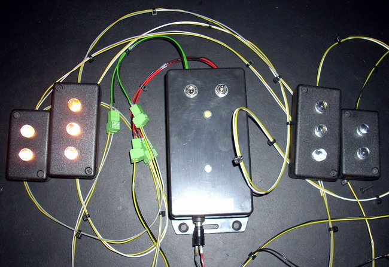

## Source code for project: [Warning strobe light controller](https://link.stdout.no/a)

Two channel strobe light controller, using the AVR ATtiny2313 microcontroller. Five flashing patterns that can be selected manually or cycled through. PWM output.

Written in basic, using [Bascom-AVR](http://www.mcselec.com/).

### Author
[Thomas Jensen](https://thomas.stdout.no)
